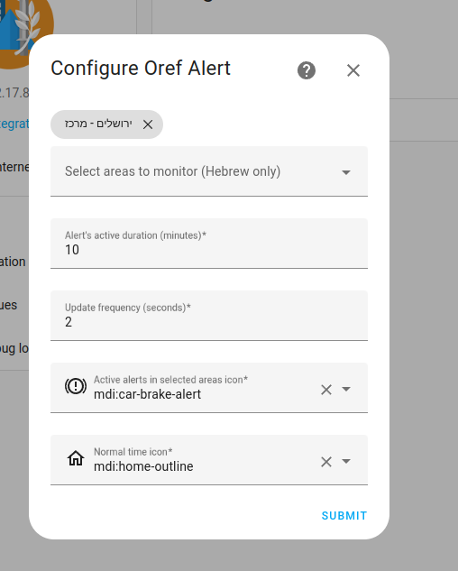
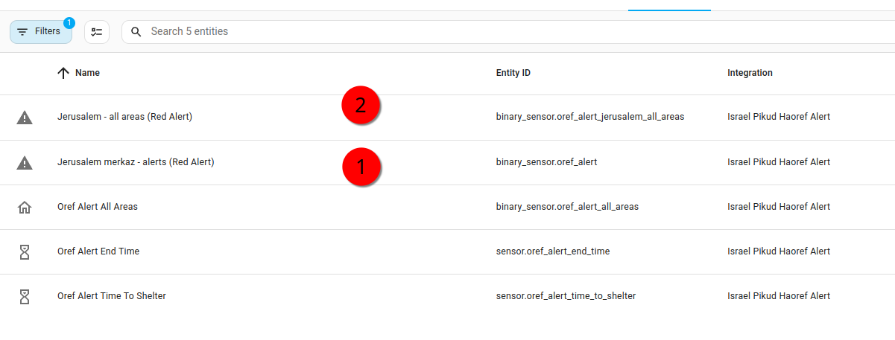
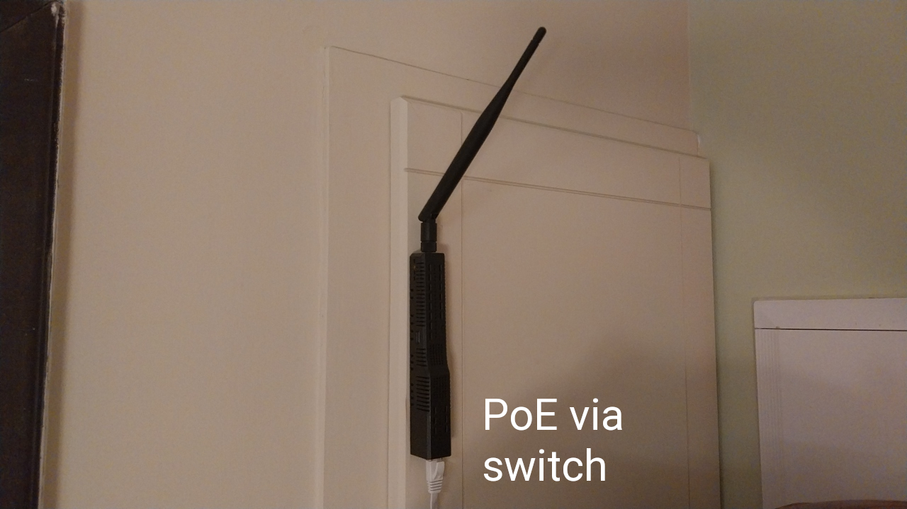
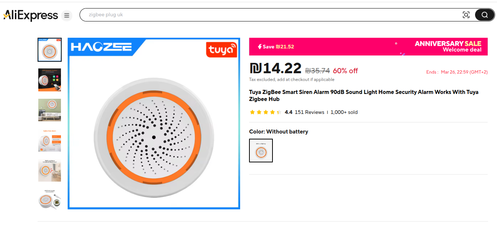
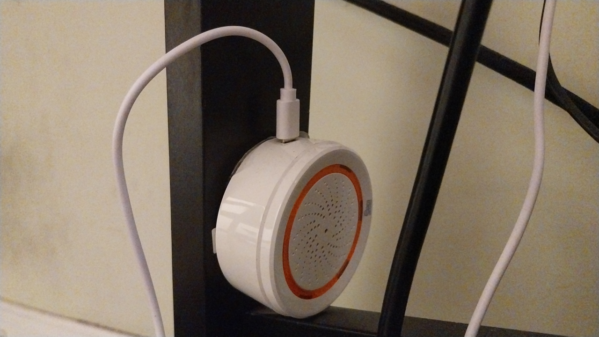
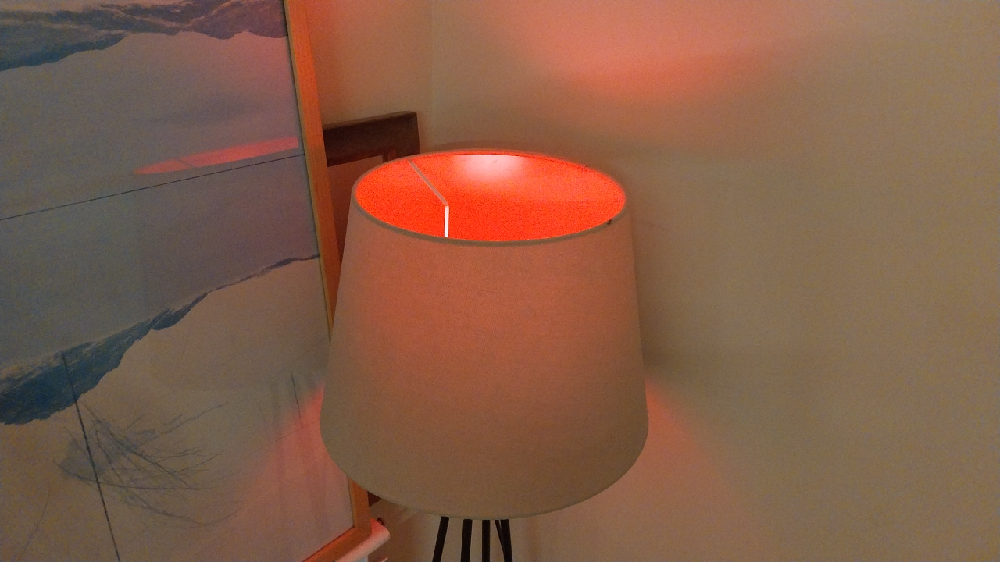
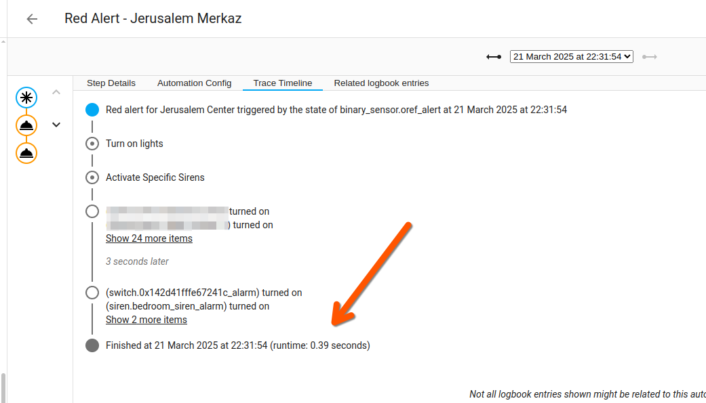

# Home Assistant Red Alert Automation Notes (Pikud HaOref)


*March 21st, 2025*

This small collection of notes was inspired by a rocket alert from Yemen.

## Hardware Summary

| Component | Supplier | Estimated Cost | Notes |
|-----------|----------|----------------|-------|
| Zigbee Controller | SM Lite / AliExpress | Varies | SLZB-06 recommended |
| Zigbee Sirens | AliExpress | $10-$20 per unit | One per room recommended |
| Zigbee E27 Bulbs | AliExpress | $10 per unit | For visual alerts |

*Note: Prices are approximations and subject to change.*

## Software Summary

| Software | Source | Purpose |
|----------|--------|---------|
| Home Assistant OS | [Home Assistant](https://www.home-assistant.io/) | Smart home platform |
| HACS | [HACS](https://hacs.xyz/) | Community store for Home Assistant |
| Oref Alert | [GitHub Repository](https://github.com/amitfin/oref_alert) | Red Alert integration |

---

Here are some ideas for setting up Home Assistant automations to integrate your home with the Red Alert system (in Hebrew: Pikud HaOref).

It uses the excellent and potentially life-saving Oref Alert project:

[](https://github.com/amitfin/oref_alert)
 
Note: This is not intended as a replacement for standard safety measures. Keep the official Home Front Command app installed on your phones and devices. This guide provides a supplementary system to extend alerting to your smart home devices.

I'll share the hardware I selected and models for automations.

## 1: Configure Oref Alert, Set Your Area(s)

First, install the Oref Alert integration.

The project has detailed documentation. Choose your alert area in Hebrew.

A useful feature of this integration is the ability to configure both primary and secondary alert areas.

This is helpful if you want to configure your main alerts for your official alerting zone while still receiving different notifications for rocket alerts in adjoining areas.



I've configured the alert that drives the main automations as my first area, with a secondary alert for other areas in Jerusalem.



## 2: Hardware: Zigbee Controller



If you're doing extensive work with Home Assistant, it's worth investing in a standalone Zigbee controller.

I highly recommend the SLZB-06 from SM Light:

[](https://smlight.tech/product/slzb-06/)

For the most reliable network connectivity, connect it to your router or switch via Ethernet. The PoE version can use Ethernet for power delivery. Place it in a position with good line-of-sight to nearby Zigbee nodes.

## 3: Zigbee Sirens (1 Per Room)



I purchased Zigbee Sirens from Aliexpress and installed one in each room. This was somewhat expensive, but I figured it was less costly than being hit by a rocket (😱).

I placed these somewhat inconspicuously so visitors don't ask too many questions about why there's an unusual sound device in every room (yes, including the bathroom).

My siren selection was primarily based on availability and affordability, but I've had no significant issues integrating them into the system.

I chose battery-less versions to avoid monitoring battery levels in multiple devices.

 

 

## 4: Red Lights 



I added several Zigbee RGB lights to the automation sequence to provide clear visual indicators.

## 5: Test With Synthetic Alerts

Test your automations immediately after setting them up.

The Oref Alert integration cleverly provides a synthetic alert for testing:

`oref_alert.synthetic_alert`

---

## Model Red Alert Automation

Below is a validated automation model that uses the alert trigger to turn on lights (both at area and individual levels) and activate sirens:

Lights with RGB capability will inherit the red color from the automation, while non-RGB lights will simply turn on.

```yaml
alias: Red Alerts in Anytown Metro - Activate Specific Sirens
description: >-
  When a Red Alert is received, trigger some actions and activate the listed
  Sirens
triggers:
  - entity_id:
      - binary_sensor.oref_alert
    to: "on"
    trigger: state
    alias: Red alert for Anytown Metro Area
actions:
  - alias: Turn on lights
    data:
      brightness_pct: 100
      rgb_color:
        - 255
        - 0
        - 0
    action: light.turn_on
    target:
      area_id:
        - master_bathroom
        - master_bedroom
        - foyer
        - kitchen
        - family_room
        - study
        - deck
        - guest_bathroom
  - alias: Activate Specific Sirens
    data: {}
    target:
      entity_id:
        - siren.master_bathroom_alarm
        - siren.master_bedroom_alarm
        - siren.study_siren_alarm
        - siren.front_door_chime
        - siren.family_room_alarm
        - siren.guest_bathroom_alarm
    action: homeassistant.turn_on
```
## You May Wish To Add: Notifications

There are many ways to extend these automations.

My focus on audible alerting and light triggers aims to make alerts nearly impossible to miss. These complement the official sirens, which typically activate at almost the same time.

If you're wearing earplugs, you'll still notice all lights suddenly turning on and RGB lights turning red. If you're in a bathroom where external sirens might be muffled, the installed (very loud) alarm will alert you.

If an alarm triggers while you're deeply asleep, every light in the bedroom turning on simultaneously will wake you up.

You could also send alerts to all devices, turn on televisions, or integrate with any other Home Assistant-compatible devices.

## Follow-Up Activity: Check A Trace 

It's valuable to check a trace after an actual alert to evaluate your automation's performance. In my last test, there was less than half a second of latency between the incoming trigger and the automation completing.



## Other Additions

Consider adding a reset button to return your home to normal after an alert, or build this functionality into the automation itself.

For the Zigbee sirens, I've configured a three-minute active period. This can be modified so the sirens don't continue sounding indefinitely after the alert has arrived.